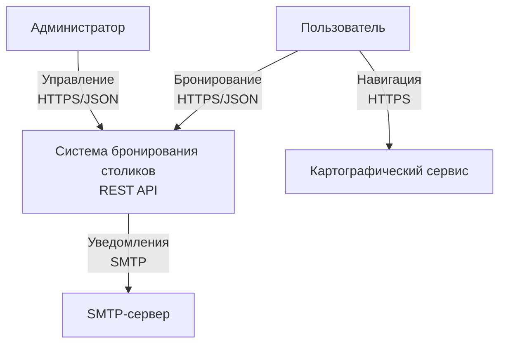
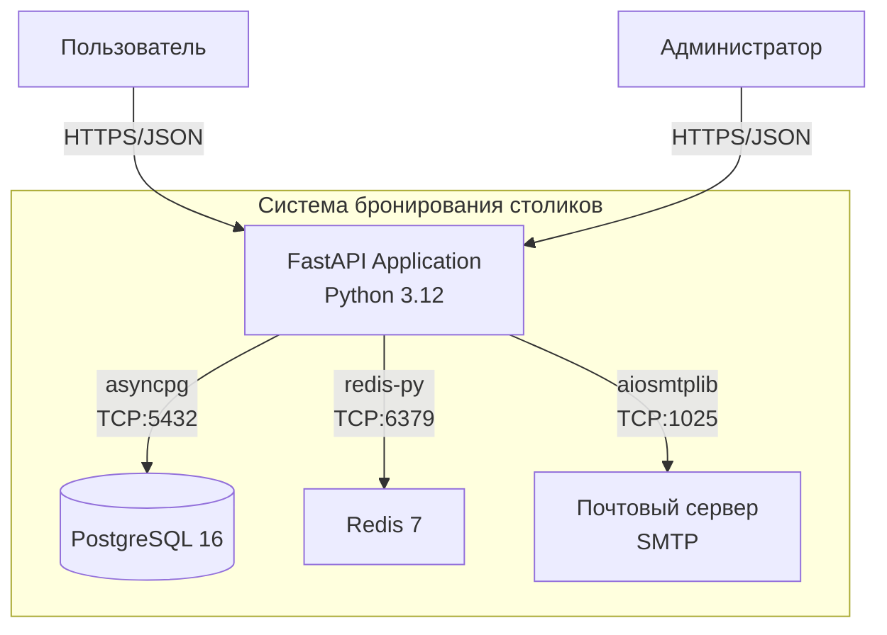
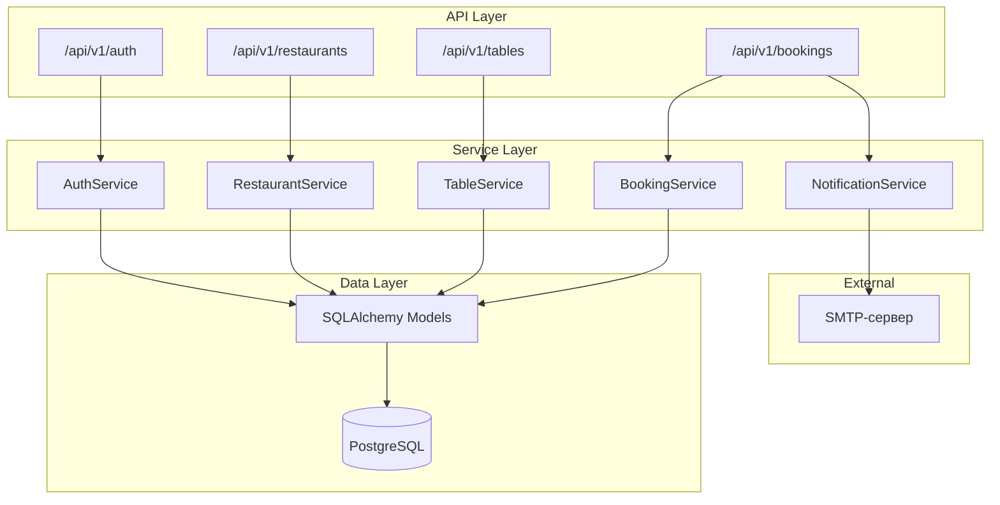
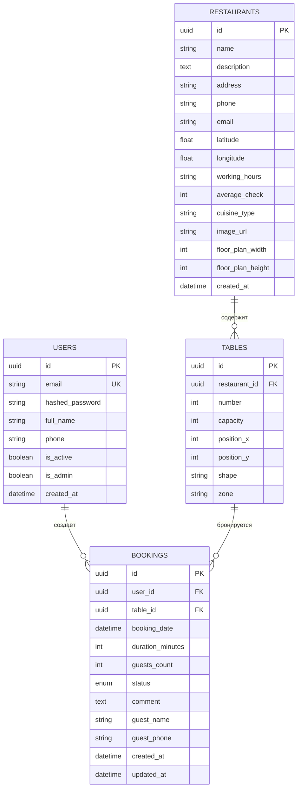
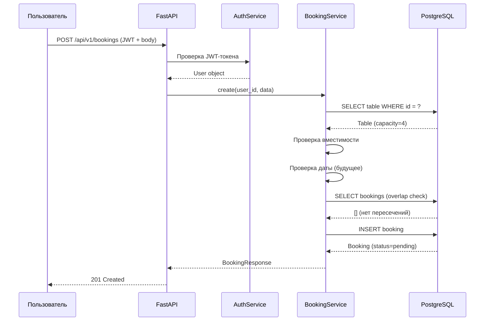
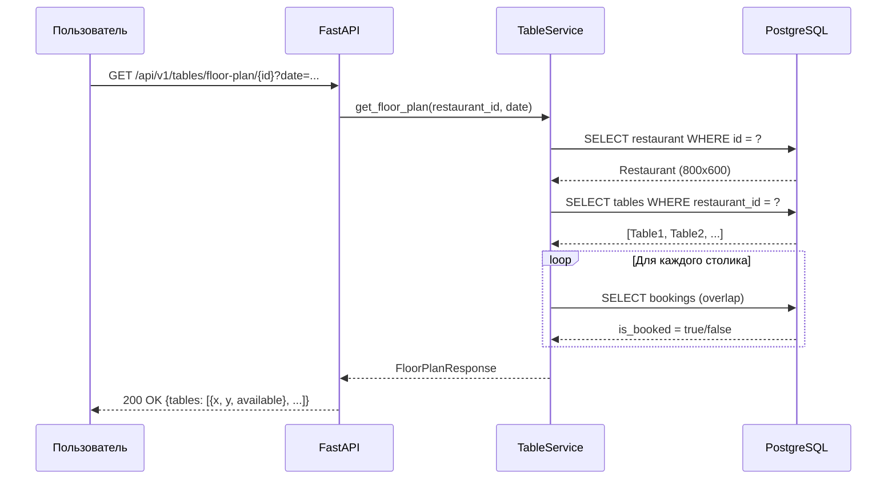

# Архитектура системы бронирования столиков

## Контекстная диаграмма

## Контейнерная диаграмма

## Компонентная диаграмма

## ER-диаграмма

## Sequence-диаграмма: Создание бронирования

## Sequence-диаграмма: Получение карты зала

