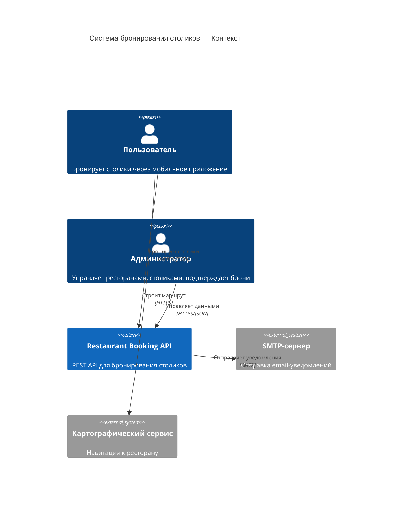
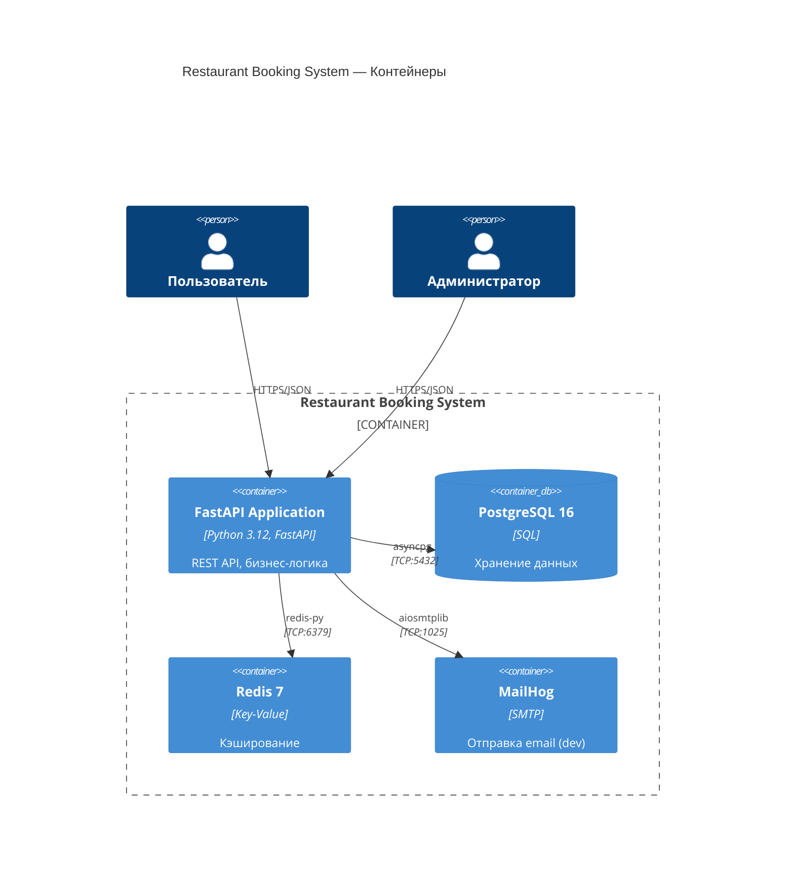
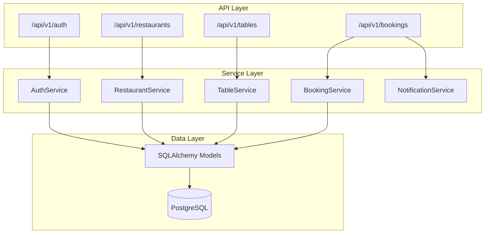
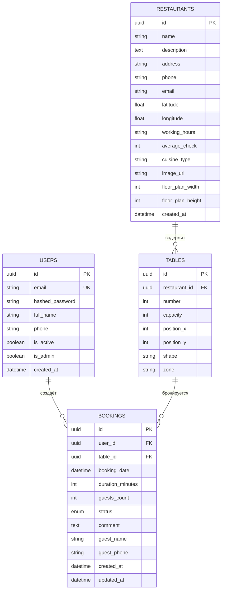
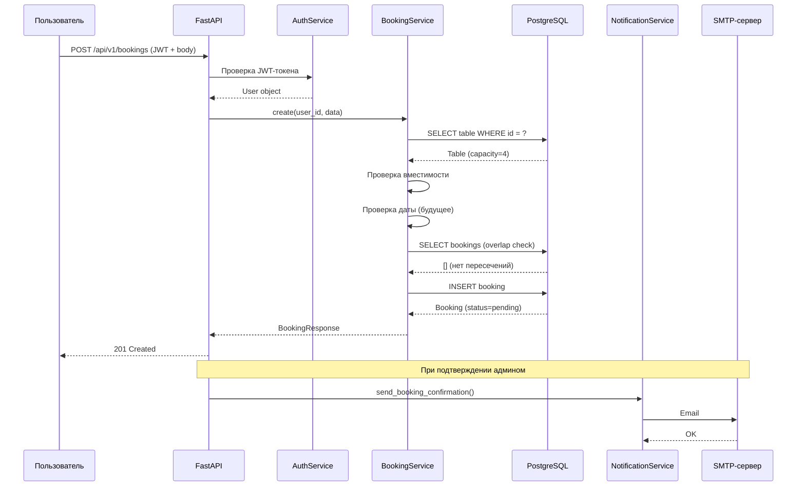
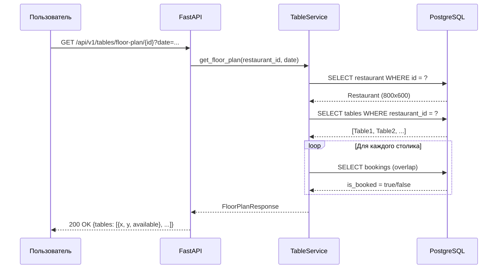

# Архитектура системы бронирования столиков

## C4 — Контекстная диаграмма

## C4 — Контейнерная диаграмма

## Компонентная диаграмма

## ER-диаграмма

## Sequence-диаграмма: Создание бронирования

## Sequence-диаграмма: Получение карты зала

